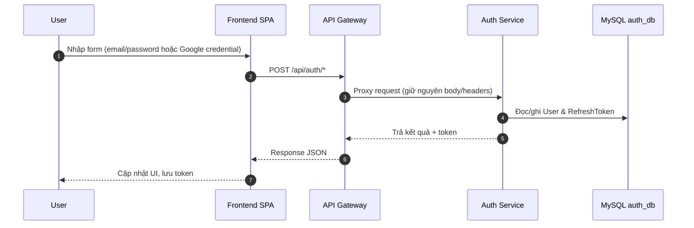
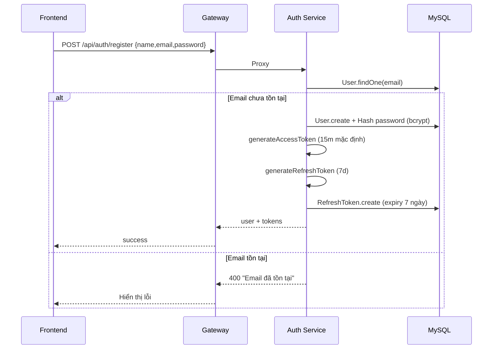
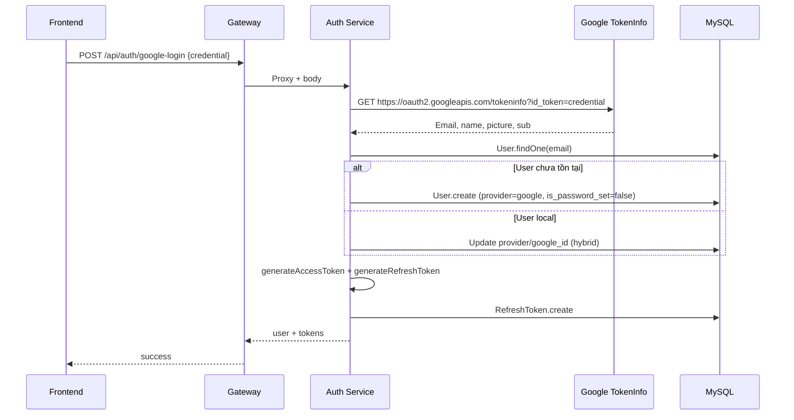
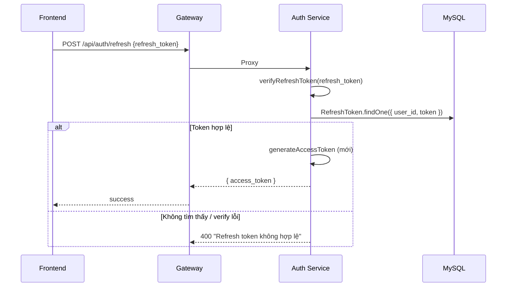

# 🔐 Tài liệu Luồng Xử Lý Auth

  
  
  

> Tài liệu mô tả chi tiết từng luồng của Auth Service (`services/auth-service/`) và cách các thành phần (Frontend → Gateway → Auth → MySQL) phối hợp. Các thông tin được tổng hợp từ `authRoutes.js`, `authController.js`, `authService.js` và `lib/jwt.js`.

---

## 1. Thành phần & trách nhiệm

| Thành phần | Vai trò trong luồng auth |
|-----------|-------------------------|
| **Frontend SPA** | Thu thập input của người dùng, lưu token (localStorage/cookie) và đính `Authorization: Bearer` khi gọi API. |
| **API Gateway (`gateway/`)** | Điểm vào duy nhất `http://localhost:8000`, xác thực Access Token với `middlewares/auth.js`, forward sang Auth Service qua nội mạng Docker. |
| **Auth Service (`services/auth-service/`)** | Thực thi nghiệp vụ đăng ký, đăng nhập, Google OAuth, refresh token, profile... |
| **MySQL (`auth_db`)** | Lưu `users`, `refresh_tokens` (qua Sequelize models `User`, `RefreshToken`). |

---

## 2. Luồng tổng thể

  <svg width="640" height="140" viewBox="0 0 640 140" role="img" aria-label="Animated auth flow" style="max-width:100%;">
    <defs>
      <linearGradient id="node-gradient" x1="0%" y1="0%" x2="100%" y2="0%">
        <stop offset="0%" stop-color="#6C63FF"/>
        <stop offset="50%" stop-color="#00BFA5"/>
        <stop offset="100%" stop-color="#FF8A65"/>
      </linearGradient>
      <linearGradient id="arrow-gradient" x1="0%" y1="0%" x2="100%" y2="0%">
        <stop offset="0%" stop-color="#6C63FF"/>
        <stop offset="100%" stop-color="#FF8A65"/>
      </linearGradient>
      <filter id="glow">
        <feGaussianBlur stdDeviation="2" result="coloredBlur"/>
        <feMerge>
          <feMergeNode in="coloredBlur"/>
          <feMergeNode in="SourceGraphic"/>
        </feMerge>
      </filter>
    </defs>
    <rect x="20" y="25" width="120" height="60" rx="14" fill="rgba(108,99,255,0.12)" stroke="#6C63FF"/>
    <rect x="170" y="25" width="120" height="60" rx="14" fill="rgba(0,191,165,0.12)" stroke="#00BFA5"/>
    <rect x="320" y="25" width="120" height="60" rx="14" fill="rgba(255,138,101,0.12)" stroke="#FF8A65"/>
    <rect x="470" y="25" width="120" height="60" rx="14" fill="rgba(48,79,254,0.12)" stroke="#304FFE"/>
    <text x="80" y="55" text-anchor="middle" fill="#6C63FF" font-weight="bold">Browser</text>
    <text x="230" y="55" text-anchor="middle" fill="#00BFA5" font-weight="bold">Gateway</text>
    <text x="380" y="55" text-anchor="middle" fill="#FF8A65" font-weight="bold">Auth Svc</text>
    <text x="530" y="55" text-anchor="middle" fill="#304FFE" font-weight="bold">MySQL</text>
    <path id="auth-flow-path" d="M 80 95 L 230 95 L 380 95 L 530 95" fill="none" stroke="url(#arrow-gradient)" stroke-width="4" stroke-linecap="round" filter="url(#glow)"/>
    <circle r="8" fill="#fff" stroke="url(#node-gradient)" stroke-width="3">
      <animateMotion dur="4.5s" repeatCount="indefinite" path="M 80 95 L 230 95 L 380 95 L 530 95 L 80 95"/>
      <animate attributeName="fill" values="#ffffff;#6C63FF;#00BFA5;#FF8A65;#304FFE;#ffffff" dur="4.5s" repeatCount="indefinite"/>
    </circle>
    <text x="80" y="120" text-anchor="middle" fill="#6C63FF" font-size="11">1. Nhập thông tin</text>
    <text x="230" y="120" text-anchor="middle" fill="#00BFA5" font-size="11">2. Proxy & verify</text>
    <text x="380" y="120" text-anchor="middle" fill="#FF8A65" font-size="11">3. Xử lý auth</text>
    <text x="530" y="120" text-anchor="middle" fill="#304FFE" font-size="11">4. Lưu token/user</text>
  </svg>
  
Animation mô phỏng vòng đời request: Browser → Gateway → Auth Service → MySQL rồi quay lại Browser.

---

## 3. Luồng chi tiết từng chức năng

### 3.1 Đăng ký (POST `/api/auth/register`)

**Key points**
- Hash password bằng `lib/bcrypt.hashPassword` trước khi lưu.
- Refresh token lưu DB với `expires_at = now + 7 days` để có thể revoke theo user.

### 3.2 Đăng nhập (POST `/api/auth/login`)
1. Frontend gửi email/password.
2. Auth Service truy vấn `User.findOne({ email })`.
3. Từ chối nếu user dùng Google nhưng chưa đặt mật khẩu (`provider === "google" && !is_password_set`).
4. So sánh password bằng `comparePassword`.
5. Sinh Access Token (`expiresIn = JWT_ACCESS_EXPIRES` hoặc `15m`) và Refresh Token (`7d`), lưu refresh token vào bảng `refresh_tokens`.
6. Trả về `{ user, access_token, refresh_token }`.

### 3.3 Google Login (POST `/api/auth/google-login`)

### 3.4 Đặt mật khẩu đầu tiên cho user Google (POST `/api/auth/set-password`, cần `Authorization`)
1. Gateway đã giải Access Token → gắn `req.user.id`.
2. Endpoint kiểm tra `newPassword` tồn tại, xác minh user `provider === "google"`.
3. Hash mật khẩu mới, cập nhật `is_password_set = true`.
4. Trả message thành công (không cấp lại token).

### 3.5 Refresh Access Token (POST `/api/auth/refresh`)

**Lưu ý:** Refresh token **không được rotate** trong luồng này; client giữ token cũ cho tới khi hết hạn hoặc logout.

### 3.6 Logout (POST `/api/auth/logout`)
- Nhận `refresh_token`.
- Xoá record tương ứng trong bảng `refresh_tokens` (`RefreshToken.destroy({ where: { token } })`).
- Không tác động Access Token (hết hạn tự nhiên).

### 3.7 Lấy profile (GET `/api/auth/profile`, Protected)
1. SPA gửi request kèm header `Authorization: Bearer <access token>`.
2. Gateway middleware `authenticate` xác thực và đính `req.user`.
3. Auth Service dùng `req.user.id` → `User.findByPk`.
4. Chỉ trả về các trường đã được sanitize (id, name, email, avatar, provider, role, is_password_set, timestamps).

---

## 4. Chu kỳ sống của JWT

| Loại token | Sinh tại | TTL mặc định | Lưu trữ | Dùng cho |
|------------|----------|--------------|---------|----------|
| **Access Token** | `generateAccessToken` (`lib/jwt.js`) | 15 phút (`JWT_ACCESS_EXPIRES`) | Chỉ trên client; Gateway/Auth kiểm tra chữ ký | Bảo vệ các route `/api/**` qua header Authorization |
| **Refresh Token** | `generateRefreshToken` | 7 ngày (`JWT_REFRESH_EXPIRES`) | Bảng `refresh_tokens` + client | Xin access token mới, logout để revoke |

> Để nâng cao bảo mật, có thể kích hoạt refresh-token rotation (tạo mới token mỗi lần refresh) và lưu fingerprint thiết bị.

---

## 5. API Endpoint Cheat Sheet

| Method & Path | Bảo vệ | Mô tả | Source |
|---------------|--------|-------|--------|
| `POST /api/auth/register` | Public | Tạo user local, trả access/refresh token | `routes/authRoutes.js` |
| `POST /api/auth/login` | Public | Đăng nhập bằng email/password | `routes/authRoutes.js` |
| `POST /api/auth/google-login` | Public | Đăng nhập qua Google ID Token | `routes/authRoutes.js` |
| `POST /api/auth/refresh` | Public | Lấy access token mới từ refresh token hợp lệ | `routes/authRoutes.js` |
| `POST /api/auth/logout` | Public | Revoke refresh token | `routes/authRoutes.js` |
| `GET /api/auth/profile` | Requires `Authorization` | Trả thông tin user đã xác thực | `routes/authRoutes.js` |
| `POST /api/auth/set-password` | Requires `Authorization` | Đặt mật khẩu đầu tiên cho user Google | `routes/authRoutes.js` |

---

## 6. Ghi chú vận hành
- Tất cả request từ Frontend phải đi qua Gateway (`http://localhost:8000`). Các service không mở port ra ngoài, nên không thể bypass gateway.
- `.env` phải khai báo `JWT_ACCESS_SECRET`, `JWT_REFRESH_SECRET` và thời gian hết hạn. Script `setup.sh` hỗ trợ tạo các file này.
- Có thể dùng script `docker-compose exec auth-service npm run db:migrate` để cập nhật schema `users`, `refresh_tokens`.
- Khi triển khai production, cân nhắc:
  - Lưu refresh token kèm user-agent/IP để phát hiện bất thường.
  - Thêm rate limit/recaptcha cho route `login` & `register`.
  - Sử dụng HTTPS + Secure Cookie nếu lưu token ở cookie.

---

  <svg width="520" height="80" viewBox="0 0 520 80" role="img" aria-label="Auth pipeline animation" style="max-width:100%;">
    <defs>
      <linearGradient id="auth-gradient" x1="0%" y1="0%" x2="100%" y2="0%">
        <stop offset="0%" stop-color="#6C63FF"/>
        <stop offset="50%" stop-color="#00BFA5"/>
        <stop offset="100%" stop-color="#FF8A65"/>
      </linearGradient>
    </defs>
    <rect x="20" y="15" width="480" height="50" rx="18" fill="none" stroke="url(#auth-gradient)" stroke-width="2"/>
    <text x="40" y="42" fill="#6C63FF" font-size="12" font-weight="bold">Client</text>
    <text x="200" y="42" fill="#00BFA5" font-size="12" font-weight="bold">Gateway</text>
    <text x="330" y="42" fill="#FF8A65" font-size="12" font-weight="bold">Auth Service</text>
    <text x="430" y="42" fill="#304FFE" font-size="12" font-weight="bold">MySQL</text>
    <circle r="6" fill="#6C63FF">
      <animateMotion dur="4s" repeatCount="indefinite" path="M 40 40 L 460 40 L 40 40" />
      <animate attributeName="fill" values="#6C63FF;#00BFA5;#FF8A65;#304FFE;#6C63FF" dur="4s" repeatCount="indefinite" />
    </circle>
  </svg>

