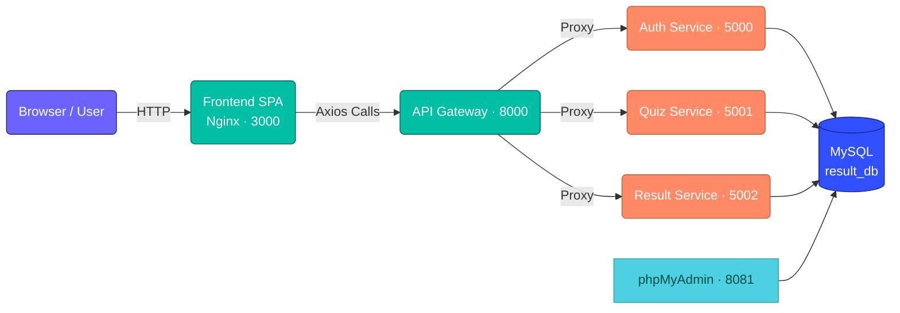

# 🧩 Tài liệu Kiến trúc & Cấu trúc Hệ thống Quiz Application

<p align="center">
  
  
  
</p>

> Phiên bản áp dụng cho thư mục `/MiniProject` hiện tại. Mục tiêu của tài liệu là giúp bạn nắm nhanh cách tổ chức mã nguồn, thành phần triển khai và dòng chảy dữ liệu trong hệ thống quiz microservices.

---

## 1. Tổng quan nhanh
- Mô hình **microservices** gồm 3 dịch vụ nghiệp vụ (Auth, Quiz, Result) giao tiếp thông qua **API Gateway**.
- **Frontend** viết bằng React + Vite, được build và phục vụ bởi Nginx container (port 3000 khi chạy bằng Docker).
- Tất cả dịch vụ backend sử dụng **Node.js 20 + Express 5** và kết nối tới một container **MySQL 8** dùng chung (mỗi service một schema riêng).
- Hệ thống được quản lý hoàn toàn bằng **Docker Compose**, có script `setup.sh` để tạo `.env` và `check-health.sh` để kiểm tra nhanh trạng thái.

---

## 2. Sơ đồ kiến trúc
```
┌──────────────────┐          ┌──────────────────┐
│  Browser / User  │  HTTP    │  Frontend (SPA)  │
│                  │  ⇄       │  Nginx container │
└────────┬─────────┘          │  Port 3000       │
         │                    └────────┬─────────┘
         │ API calls (Axios)          │ Only talks to
         ▼                            ▼
                             ┌────────────────────┐
                             │    API Gateway     │  Port 8000
                             │ (single entrypoint)│
                             └────────┬───────────┘
                                      │
         ┌────────────────────────────┼────────────────────────────┐
         │        Docker network `quiz-net` (internal only)        │
         │                                                        │
         │  ┌────────────────┐   ┌────────────────┐   ┌────────────────┐
         │  │ Auth Service   │   │ Quiz Service   │   │ Result Service │
         │  │ Port 5000      │   │ Port 5001      │   │ Port 5002      │
         │  └────────┬───────┘   └────────┬───────┘   └────────┬───────┘
         │           │                    │                    │
         │        ┌──▼────────────────────▼────────────────────▼──┐
         │        │              MySQL 8 Container               │
         │        │ auth_db | quiz_db | result_db (3306)         │
         │        └──────────────────────────────────────────────┘
         └────────────────────────────────────────────────────────┘

            (phpMyAdmin container chia sẻ `quiz-net`, mở port 8081 ra ngoài)
```



<div align="center">
  <svg width="500" height="90" viewBox="0 0 500 90" role="img" aria-label="Animated request flow" style="max-width:100%;">
    <defs>
      <linearGradient id="flow-gradient" x1="0%" y1="0%" x2="100%" y2="0%">
        <stop offset="0%" stop-color="#6C63FF"/>
        <stop offset="50%" stop-color="#00BFA5"/>
        <stop offset="100%" stop-color="#FF8A65"/>
      </linearGradient>
      <filter id="glow">
        <feGaussianBlur stdDeviation="4" result="coloredBlur"/>
        <feMerge>
          <feMergeNode in="coloredBlur"/>
          <feMergeNode in="SourceGraphic"/>
        </feMerge>
      </filter>
    </defs>
    <rect x="10" y="15" width="480" height="60" rx="18" fill="url(#flow-gradient)" opacity="0.15"/>
    <text x="35" y="40" fill="#6C63FF" font-size="12" font-weight="bold">Browser</text>
    <text x="195" y="40" fill="#00BFA5" font-size="12" font-weight="bold">Gateway</text>
    <text x="360" y="40" fill="#FF7043" font-size="12" font-weight="bold">Services</text>
    <line x1="60" y1="52" x2="440" y2="52" stroke="url(#flow-gradient)" stroke-width="3" stroke-linecap="round" filter="url(#glow)"/>
    <circle id="pulse" cx="60" cy="52" r="6" fill="#fff">
      <animate attributeName="cx" values="60;440;60" dur="4s" repeatCount="indefinite" />
      <animate attributeName="fill" values="#6C63FF;#00BFA5;#FF8A65;#6C63FF" dur="4s" repeatCount="indefinite" />
    </circle>
  </svg>
</div>

> **Quan trọng:** Frontend không bao giờ gọi trực tiếp vào các service Auth/Quiz/Result; tất cả request buộc phải đi qua API Gateway (port 8000) để áp dụng kiểm soát truy cập, logging và routing thống nhất.

---

## 3. Thành phần & trách nhiệm chính

| Thành phần | Nhiệm vụ | Công nghệ chính | Đường dẫn | Ports/URL |
|------------|----------|-----------------|-----------|-----------|
| Frontend | SPA cho người dùng quiz, hiển thị dashboard/kết quả | React 19, Vite, TailwindCSS, React Router, Zustand, React Query | `frontend/` | Dev: `5173`, Docker: `3000` |
| API Gateway | Đầu mối duy nhất nhận request từ FE, định tuyến & áp dụng security | Express 5, `http-proxy-middleware`, JWT verify | `gateway/` | `8000` |
| Auth Service | Đăng ký, đăng nhập, cấp refresh/access token, quản lý hồ sơ | Express, Sequelize, JWT, bcrypt | `services/auth-service/` | `5000` (internal) |
| Quiz Service | CRUD quiz/câu hỏi, upload media, phục vụ dữ liệu thi | Express, Sequelize, Multer | `services/quiz-service/` | `5001` (internal) |
| Result Service | Ghi nhận kết quả thi, thống kê, lịch sử làm bài | Express, Sequelize | `services/result-service/` | `5002` (internal) |
| MySQL | Lưu trữ dữ liệu cho cả 3 services (mỗi DB riêng) | MySQL 8, init script | `scripts/init-db.sql` | `3306` (container) / `3306` host |
| phpMyAdmin | Giao diện quản trị DB | phpMyAdmin 5 | Docker service `phpmyadmin` | `8081` |

---

## 4. Luồng xử lý chuẩn
1. Người dùng truy cập SPA → các trang được build sẵn bởi Vite và serve qua Nginx container `frontend`.
2. SPA gọi API tới `http://localhost:8000` (gateway là **điểm vào duy nhất**; các service nội bộ không được expose ra host). Gateway áp dụng CORS, logging (`morgan`), `compression` và middleware `authenticate` (với JWT Access Token) cho các route cần bảo vệ.
3. Tùy URL:
   - `/api/auth/**` được chuyển tới Auth Service (giữ nguyên path nhờ `pathRewrite`).
   - `/api/quiz/**` và `/uploads/**` chuyển tới Quiz Service, hỗ trợ forward file upload/static.
   - `/api/result/**` chuyển tới Result Service (strip prefix `/api/result`).
4. Mỗi service xử lý nghiệp vụ qua các tầng `routes → controllers → services → models`, tương tác với schema MySQL tương ứng thông qua Sequelize.
5. Kết quả trả về qua Gateway đến Frontend. Các state (token, kết quả, quiz) được quản lý client-side bằng React Query/Zustand.

---

## 5. Chi tiết từng lớp

### 5.1 Frontend (`frontend/`)
- **Stack**: React 19, Vite, TailwindCSS 4, React Router 7, Zustand, React Query, Axios.
- **Cấu trúc chính**:
  - `src/lib/`: config Axios, QueryClient.
  - `src/services/`: định nghĩa API client giao tiếp gateway.
  - `src/stores/`: các store Zustand cho auth/session.
  - `src/hooks/`: custom hooks (ví dụ useAuth, useQuiz).
- **Build & deploy**: `Dockerfile` build app và copy vào Nginx (`nginx.conf` điều chỉnh SPA fallback). Khi chạy Docker Compose, container mở port 80 bên trong → map ra host `3000`.

### 5.2 API Gateway (`gateway/`)
- **index.js**: cấu hình Express app, bật `cors`, `compression`, `morgan`, custom `requestLogger`, và health route `GET /`.
- **config/routes.js**: nơi đăng ký toàn bộ proxy. Dùng `http-proxy-middleware` để giữ nguyên URL gốc, đồng thời inject headers cần thiết (ví dụ `uploads` thiết lập CORS bổ sung).
- **middlewares/auth.js**: xác thực JWT Access Token bằng `JWT_ACCESS_SECRET`, đính user vào `req.user`.
- **.env mẫu**: định nghĩa URL cho từng service (`AUTH_SERVICE_URL`, `QUIZ_SERVICE_URL`, `RESULT_SERVICE_URL`) và secret JWT để gateway validate token.

### 5.3 Dịch vụ backend (`services/…`)
Mỗi service đều có các thư mục tương đồng:
- `routes/` (hoặc `src/module/*/routes.js` đối với Quiz Service) định nghĩa endpoints.
- `controllers/` xử lý request/response, validate dữ liệu cùng `validators/`.
- `services/` chứa business logic, tái sử dụng ở controllers.
- `models/` + `migrations/` + `seeders/` quản lý schema bằng Sequelize CLI.
- `middlewares/` (Auth Service có middleware JWT riêng cho internal use).
- `lib/response.js` chuẩn hóa output JSON.
- `Dockerfile` chuẩn hóa runtime Node 20, copy mã, cài đặt dependencies và chạy `node index.js`.

#### Auth Service (`services/auth-service/`)
- **Chức năng**: đăng ký người dùng, đăng nhập, refresh token, quản lý profile và đổi mật khẩu.
- **Thư mục nổi bật**:
  - `controllers/auth.controller.js`: nhận yêu cầu từ gateway.
  - `services/auth.service.js`: xử lý create user, verify password, tạo JWT, refresh token rotation.
  - `lib/bcrypt.js`, `lib/jwt.js`: tiện ích hash password và tạo token.
  - `validators/auth.validator.js`: sử dụng `express-validator`.
- **CSDL**: schema `auth_db`, user DB `auth_user/auth_pass`.

#### Quiz Service (`services/quiz-service/`)
- **Chức năng**: quản lý danh mục, câu hỏi, bài quiz, upload ảnh (thông qua `multer`), truy vấn câu hỏi theo quiz.
- **Cấu trúc module hóa** (`src/module`): ví dụ `quiz`, `question`, `category` (mỗi module có `controller`, `service`, `route`).
- **Database**: `quiz_db`. Các model Sequelize (trong `models/`) map tới bảng quiz/question/answer.
- **Static/Upload**: route `/uploads` được proxy trực tiếp để khách truy cập file media.

#### Result Service (`services/result-service/`)
- **Chức năng**: lưu lịch sử làm bài, điểm, thống kê leaderboard/tiến độ.
- **Mở rộng**: có thể tích hợp với quiz service qua foreign key (user_id, quiz_id) dựa trên dữ liệu từ gateway.
- **Schema**: `result_db` với migrations và seeders riêng, script CLI giống auth service.

---

## 6. Dữ liệu & hạ tầng

### 6.1 Database MySQL dùng chung
- Được định nghĩa trong `docker-compose.yml` dưới service `mysql-db`.
- Script `scripts/init-db.sql` chạy khi container start, tạo 3 database + user:

| Schema | User | Password | Port truy cập |
|--------|------|----------|---------------|
| `auth_db` | `auth_user` | `auth_pass` | Host `3306` |
| `quiz_db` | `quiz_user` | `quiz_pass` | Host `3306` |
| `result_db` | `result_user` | `result_pass` | Host `3306` |

- **Volumes**: `mysql_data` lưu dữ liệu bền vững.
- **Healthcheck**: `mysqladmin ping` đảm bảo DB healthy trước khi services phụ thuộc khởi động.

### 6.2 phpMyAdmin
- Service `phpmyadmin` trong Compose kết nối tới `mysql-db`, hỗ trợ thao tác nhanh.
- Truy cập: `http://localhost:8081`, đăng nhập bằng user tương ứng ở bảng trên hoặc root (`root/root`).

---

## 7. Tổ chức thư mục & script quan trọng

| Đường dẫn | Vai trò |
|-----------|---------|
| `docker-compose.yml` | Định nghĩa toàn bộ container (gateway, services, frontend, MySQL, phpMyAdmin). Có giới hạn CPU/RAM cho từng service. |
| `docker-compose.override.yml` | Tùy chỉnh thêm cho môi trường dev (nếu cần). |
| `setup.sh` | Script tạo `.env` cho từng service và gateway (sao chép từ `.env.example`). |
| `check-health.sh` | Script shell kiểm tra nhanh gateway, các service, frontend và phpMyAdmin rồi in `docker-compose ps`. |
| `scripts/init-db.sql` | Bootstrap database/users cho MySQL container. |
| `documents/` | Thư mục lưu trữ tài liệu nội bộ (file hiện tại đặt ở đây). |

---

## 8. Quy trình phát triển & vận hành đề xuất

1. **Chuẩn bị**: cài Docker, Docker Compose, Node.js (nếu muốn chạy từng service).
2. **Thiết lập môi trường**:
   ```bash
   ./setup.sh          # tạo .env cho gateway + các service
   docker-compose up -d --build
   ```
3. **Migration & Seed (nếu cần)**:
   ```bash
   docker-compose exec auth-service npm run db:migrate
   docker-compose exec quiz-service npm run db:migrate
   docker-compose exec result-service npm run db:migrate
   ```
4. **Giám sát**:
   - `docker-compose logs -f <service>` để xem log chi tiết.
   - `./check-health.sh` để ping các endpoint health & kiểm tra container đang chạy.
5. **Phát triển cục bộ**:
   - Có thể chạy từng service bằng `npm run dev` (nodemon) sau khi cài dependencies trong thư mục tương ứng.
   - Frontend dev server chạy `npm run dev` → port `5173`, truy cập gateway qua `.env` Vite (`VITE_API_URL=http://localhost:8000`).

---

## 9. Tài liệu tham chiếu
- `README.md`: mô tả chung về kiến trúc, hướng dẫn khởi động nhanh.
- `QUICKSTART.md`: checklist thiết lập nhanh.
- `PROJECT_STRUCTURE.md`: tham khảo cấu trúc chi tiết từng thư mục (cập nhật khi có thay đổi).

---

### Ghi chú mở rộng
- Các service backend đang dùng chung MySQL; nếu cần tách DB vật lý (ví dụ chuyển Quiz sang MongoDB), cập nhật lại `docker-compose.yml`, `sequelize` configs và tài liệu này.
- Hãy cập nhật tài liệu này khi thêm service mới, đổi port, hoặc thay đổi luồng proxy tại gateway để đảm bảo mọi thành viên nắm được cấu trúc mới nhất.
