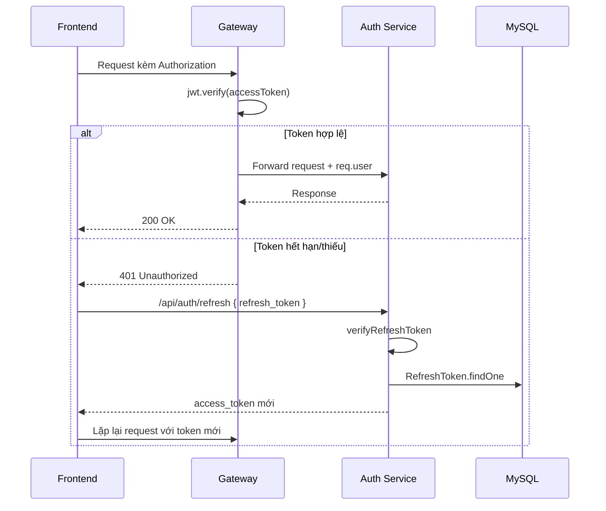
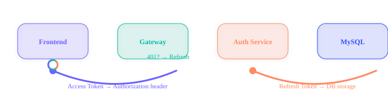

# 🔑 Hướng Dẫn Sử Dụng Token Trong Quiz Application

  
  
  

Tài liệu này mô tả cách hệ thống phát hành, lưu trữ, sử dụng và làm mới JWT trong dự án microservices. Nguồn tham chiếu chính: `services/auth-service/services/authService.js`, `gateway/middlewares/auth.js`, `frontend/src/shared/utils/axios.js`, `frontend/src/features/auth/stores/authStore.js`.

---

## 1. Phân loại token

| Loại token | Nguồn sinh | TTL mặc định | Lưu ở đâu | Công dụng |
|------------|-----------|--------------|-----------|-----------|
| **Access Token** | `generateAccessToken` trong Auth Service | `JWT_ACCESS_EXPIRES` (mặc định 15 phút) | Client (localStorage) | Gọi API thông qua Gateway bằng header `Authorization: Bearer ...` |
| **Refresh Token** | `generateRefreshToken` trong Auth Service | `JWT_REFRESH_EXPIRES` (mặc định 7 ngày) | Client + bảng `refresh_tokens` | Xin Access Token mới, revoke khi logout |

Cả hai token đều mang payload `{ id, email? }` để Gateway/Service biết user ID mà không cần truy vấn thêm (`services/auth-service/services/authService.js:32-83`).

---

## 2. Quy trình phát hành

1. **Register/Login/Google Login**:
   - Auth Service tạo user (nếu cần), sau đó sinh Access Token + Refresh Token và lưu Refresh Token vào DB với thời hạn 7 ngày (`services/auth-service/services/authService.js:32-134`).
   - Kết quả trả về qua Gateway đến Frontend ở dạng `data.access_token` và `data.refresh_token`.

2. **Frontend lưu token**:
   - Store Zustand gọi `setAuth` → `localStorage.setItem('token')` + `setItem('refreshToken')` (`frontend/src/features/auth/stores/authStore.js:7-27`).
   - Khi logout, cả hai token bị xóa khỏi localStorage và state (`frontend/src/features/auth/stores/authStore.js:16-20`).

---

## 3. Lưu trữ & truyền tải

### 3.1 Client
- Access Token nằm trong localStorage để axios interceptor đọc và gắn vào tất cả request (`frontend/src/shared/utils/axios.js:26-33`).
- Refresh Token cũng lưu localStorage (chỉ sử dụng khi bị 401, xem mục 4).

### 3.2 Backend
- Bảng `refresh_tokens` (qua model `RefreshToken`) giữ `user_id`, `token`, `expires_at`. Tất cả hành động `register/login/google-login` đều thêm record mới (`services/auth-service/services/authService.js:41-131`).
- Gateway không lưu token, chỉ verify chữ ký khi request tới các route bảo vệ (`gateway/middlewares/auth.js:3-24`).

---

## 4. Xác thực & làm mới

  
   
  Quy trình trực quan: Frontend gửi Access Token → Gateway verify → Auth Service đọc bảng Refresh Token và phản hồi.

### Các bước cụ thể
1. **Trước mỗi request**, axios interceptor lấy Access Token trong localStorage và gắn header `Authorization` (`frontend/src/shared/utils/axios.js:26-33`).
2. **Gateway middleware** kiểm tra header, tách token, verify bằng `JWT_ACCESS_SECRET` và đính payload vào `req.user` (`gateway/middlewares/auth.js:5-20`).
3. **Khi nhận 401**, interceptor thử gọi `/api/auth/refresh` (kèm Refresh Token) để lấy Access Token mới, sau đó retry API ban đầu (`frontend/src/shared/utils/axios.js:42-87`).
4. **Auth Service** kiểm tra Refresh Token bằng `verifyRefreshToken` + tìm record DB. Nếu hợp lệ, tạo Access Token mới và trả về (`services/auth-service/services/authService.js:165-180`).
5. Nếu refresh thất bại → client xóa token, redirect về `/login` để đảm bảo user re-authenticate (`frontend/src/shared/utils/axios.js:57-84`).

---

## 5. Thu hồi & đăng xuất

- Endpoint `POST /api/auth/logout` nhận Refresh Token, xóa record tương ứng khỏi DB (`services/auth-service/services/authService.js:185-188`).
- Frontend đồng thời xóa token khỏi localStorage (`frontend/src/features/auth/stores/authStore.js:16-20`).
- Access Token còn hiệu lực sẽ tự hết hạn sau TTL; không có danh sách đen, vì vậy logout chủ yếu dựa vào refresh token revoke.

---

## 6. Hướng dẫn tích hợp

### 6.1 Frontend
- Luôn đọc token từ `useAuthStore` thay vì tự lưu biến tạm.
- Bắt đầu app hãy gọi `initAuth()` để đồng bộ state với localStorage (ví dụ khi refresh trang) (`frontend/src/features/auth/stores/authStore.js:21-27`).
- Khi tạo request tùy chỉnh (ngoài `axiosInstance`), nhớ đính `Authorization` hoặc dùng lại `axiosInstance` để tận dụng interceptor.

### 6.2 Backend / Services khác
- Các service nội bộ chỉ nên tin `req.user` đến từ Gateway. Nếu cần tự verify (ví dụ WebSocket), có thể tái sử dụng `services/auth-service/middlewares/auth.js`.
- Khi thêm route cần bảo vệ ở Gateway, hãy bọc middleware `authenticate` hoặc implement logic tương tự (xem `gateway/middlewares/auth.js:3-24`).

---

## 7. Lời khuyên bảo mật

1. **Bảo vệ secret**: `JWT_ACCESS_SECRET` và `JWT_REFRESH_SECRET` phải khác nhau và không commit lên repo. Script `setup.sh` hỗ trợ tạo `.env`.
2. **HTTPS**: Khi deploy production, bắt buộc chạy qua HTTPS để tránh token bị sniff.
3. **Giới hạn refresh**: Có thể bổ sung refresh-token rotation hoặc cột `device_id/user_agent` trong bảng `refresh_tokens` để phát hiện xâm nhập.
4. **Xóa token khi đổi mật khẩu**: Khi người dùng đổi mật khẩu, cân nhắc xóa toàn bộ refresh token trong DB để buộc đăng nhập lại.
5. **Storage**: Nếu lo ngại XSS, có thể chuyển Access Token sang HTTP-only cookie; khi đó cập nhật interceptor tương ứng.

---

  <svg width="560" height="90" viewBox="0 0 560 90" role="img" aria-label="Token lifecycle" style="max-width:100%;">
    <defs>
      <linearGradient id="token-gradient" x1="0%" y1="0%" x2="100%" y2="0%">
        <stop offset="0%" stop-color="#6C63FF"/>
        <stop offset="50%" stop-color="#00BFA5"/>
        <stop offset="100%" stop-color="#FF8A65"/>
      </linearGradient>
    </defs>
    <rect x="20" y="20" width="520" height="50" rx="16" fill="none" stroke="url(#token-gradient)" stroke-width="2"/>
    <text x="80" y="50" text-anchor="middle" fill="#6C63FF" font-weight="bold">Issue</text>
    <text x="200" y="50" text-anchor="middle" fill="#00BFA5" font-weight="bold">Store</text>
    <text x="320" y="50" text-anchor="middle" fill="#FF8A65" font-weight="bold">Use</text>
    <text x="440" y="50" text-anchor="middle" fill="#304FFE" font-weight="bold">Refresh/Logout</text>
    <circle r="7" fill="#6C63FF">
      <animateMotion dur="5s" repeatCount="indefinite" path="M 60 45 L 180 45 L 300 45 L 420 45 L 500 45 L 60 45"/>
      <animate attributeName="fill" values="#6C63FF;#00BFA5;#FF8A65;#304FFE;#6C63FF" dur="5s" repeatCount="indefinite"/>
    </circle>
  </svg>
  
Token được phát hành ở Auth Service → lưu client/DB → dùng ở Gateway → làm mới hoặc thu hồi.

